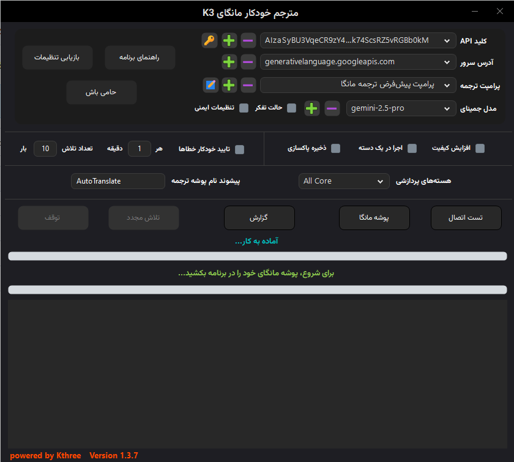

<!-- START OF README.md -->

  <!-- LOGO -->
  

  <!-- TITLE -->
  <h1>K3 Manga Auto Translator</h1>

  <!-- SUBTITLE -->
  <h3>
    پایان انتظار برای چپترهای جدید. 
    ترجمه، پاکسازی و تایپ؛ کاملاً خودکار و هوشمند.
  </h3>

   

  <!-- LINK BUTTON (Corrected Structure) -->
  <!-- 👇 لینک سایت جدیدت رو جایگزین YOUR_AUTO_WEBSITE_URL_HERE کن 👇 -->
  <h2>
    <a href="https://kthree-k3.github.io/K3-Manga-AutoTranslate">
      🔗 برای ورود به صفحه دانلود و معرفی برنامه کلیک کنید
    </a>
  </h2>

 

## 📖 چرا نسخه خودکار؟

همه ما حس انتظار برای ترجمه شدن مانگای مورد علاقه‌مان را تجربه کرده‌ایم. نسخه خودکار **K3** دقیقاً برای پایان دادن به همین انتظارها ساخته شده است.

برخلاف نسخه ادیتور که ابزاری برای مترجمان است، این ابزار برای **شما (خوانندگان)** ساخته شده تا با قدرت هوش مصنوعی، هر مانگایی را به سادگی ترجمه کنید. کافیست پوشه مانگا را بکشید و رها کنید؛ تمام مراحل استخراج متن، پاکسازی تصویر و جایگذاری ترجمه به صورت هوشمند انجام می‌شود.

> **برای کمک به جامعه‌ی مترجمان فارسی‌زبان، این برنامه با تمام قابلیت‌های حرفه‌ای‌اش به صورت کاملاً رایگان منتشر شده است.**

 

## 📸 نمای محیط برنامه

  

 

  Developed with ❤️ by Kthree Team

